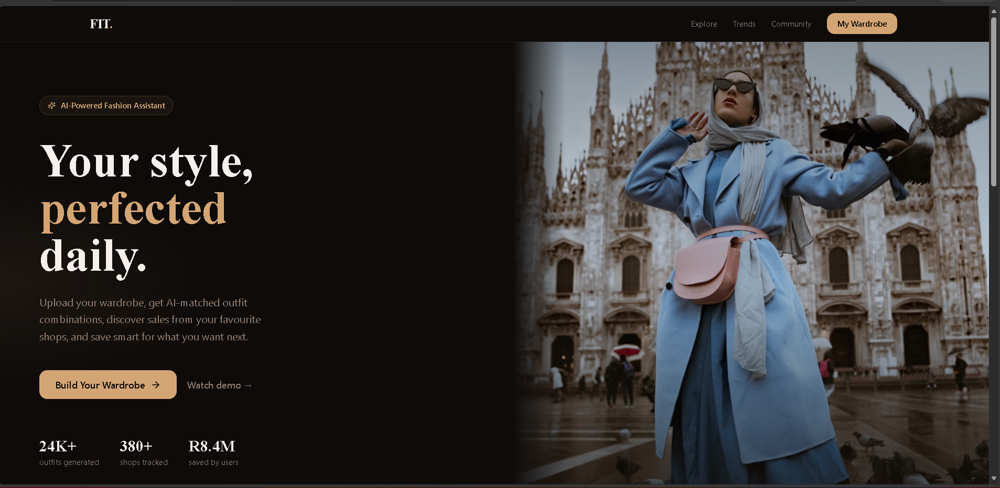
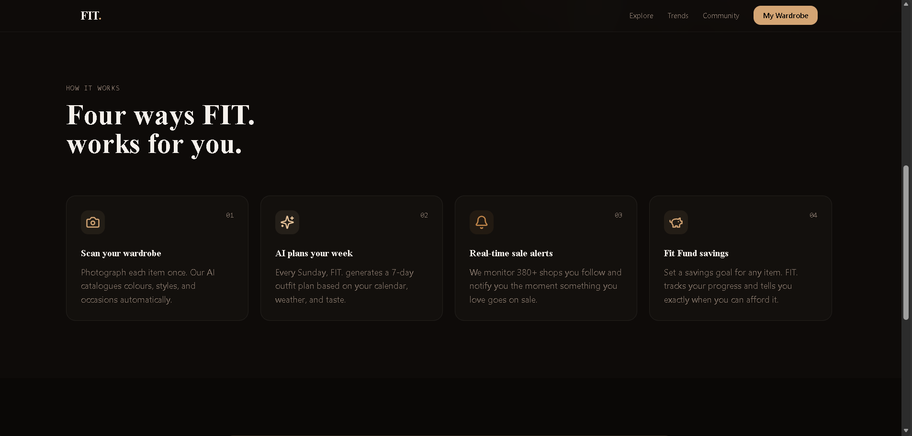
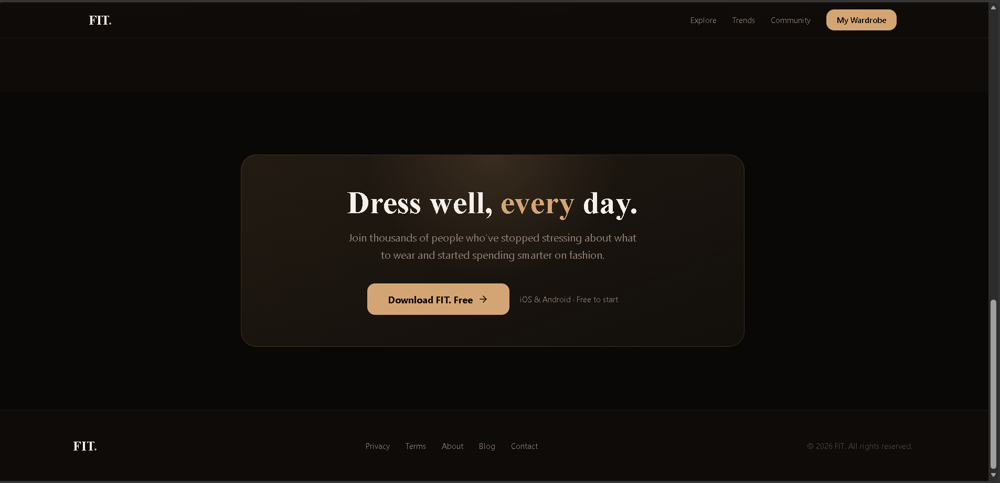
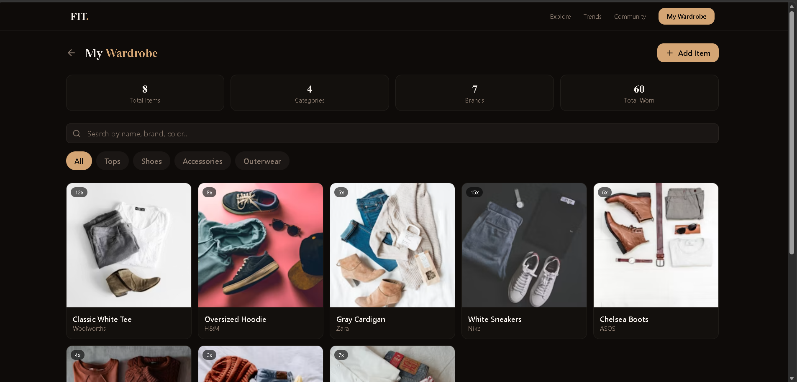
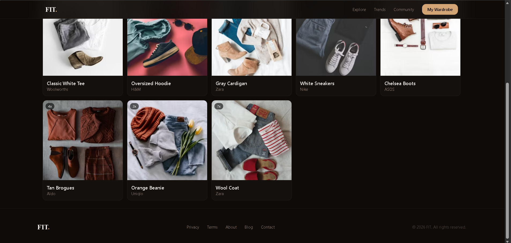

# 👗 FashionApp

[](https://nextjs.org/)
[](https://reactjs.org/)
[](https://tailwindcss.com/)
[](https://www.typescriptlang.org/)
[](https://opensource.org/licenses/MIT)
[](https://github.com/mastersflash19/fashionapp)

---

## 📖 Description

**FashionApp** is a modern, AI-powered fashion web application built with **Next.js 14**, **React**, **TypeScript**, and **Tailwind CSS**. The app helps users discover their perfect style through personalized recommendations, virtual try-on, and smart shopping features.

---

## ✨ Features

### 🧠 AI-Powered Fashion Assistant
- Upload your wardrobe and get AI-matched outfit combinations
- Personalized style recommendations based on your preferences
- Color analysis and matching suggestions

### 📅 AI Wardrobe Planning
- Scan your wardrobe items once
- AI generates a 7-day outfit plan based on your calendar, weather, and taste
- Smart outfit combinations for every occasion

### 🛍️ Smart Shopping & Sales
- Track 380+ shops for real-time sale alerts
- Get notified when items you love go on sale
- Smart savings with intelligent price tracking

### 💰 Fit Fund Savings
- Set savings goals for any item
- Track your progress towards your goal
- Get notified exactly when you can afford it

### 👗 My Wardrobe Management
- Upload and organize your entire wardrobe
- Categorize by type (Tops, Shoes, Accessories, Outerwear)
- Track items, brands, and how often you wear each piece
- Search by name, brand, or color

---

## 📸 Screenshots

### Hero Section
The main landing page showcasing the AI-powered fashion assistant.



### How It Works
Four key features that make FashionApp work for you - scan wardrobe, AI planning, real-time sales, and savings.



### Footer & Trust Signals
Clean footer design with trust signals and social proof.



### My Wardrobe Dashboard
Manage your entire wardrobe with categories, brands, and search functionality.



### Wardrobe Items View
Detailed view of wardrobe items with brand and usage tracking.



### Full Page Gallery

| Desktop Hero | Mobile View |
|--------------|-------------|
|  |  |

| Wardrobe Dashboard | Item Management |
|--------------------|-----------------|
|  |  |

---

## 🎯 Key Features Explained

### How FIT. Works

| Feature | Description |
|---------|-------------|
| **Scan Your Wardrobe** | Photograph each item once. AI catalogues colours, styles, and occasions automatically |
| **AI Plans Your Week** | Every Sunday, AI generates a 7-day outfit plan based on your calendar, weather, and taste |
| **Real-Time Sale Alerts** | We monitor 380+ shops you follow and notify you when something you love goes on sale |
| **Fit Fund Savings** | Set a savings goal for any item. Track progress and get notified when you can afford it |

### Wardrobe Management
- 📸 Upload and organize your clothing items
- 🏷️ Categorize by type: Tops, Shoes, Accessories, Outerwear
- 🔍 Search by name, brand, or colour
- 👕 Track total items, categories, brands, and items worn
- 📊 View item usage statistics (12x, 15x, etc.)

### Supported Brands
Examples of tracked brands:
- Woolworths
- H&M
- Zara
- Nike
- ASOS
- Aldo
- Uniqlo

---

## 🛠️ Technologies Used

| Technology | Purpose |
|------------|---------|
| **Next.js 14** | React framework with App Router |
| **React 18** | UI component library |
| **TypeScript** | Type-safe JavaScript |
| **Tailwind CSS** | Utility-first CSS framework |
| **Lucide Icons** | Beautiful icon library |
| **Unsplash API** | High-quality images |

### Key Features
- ✅ Server-Side Rendering (SSR)
- ✅ Static Site Generation (SSG)
- ✅ API Routes for backend functionality
- ✅ Client-side interactivity with React hooks
- ✅ Intersection Observer for scroll animations
- ✅ Responsive design for all devices
- ✅ Accessibility (a11y) support

---

## 🚀 Installation

### Prerequisites
- **Node.js** 18.17 or higher
- **npm** or **yarn** package manager
- **Git** (for cloning)

### Steps

```bash
# Clone the repository
git clone https://github.com/mastersflash19/fashionapp.git

# Navigate to project directory
cd fashionapp

# Install dependencies
npm install
# or
yarn install

# Run development server
npm run dev
# or
yarn dev

# Open in browser
# http://localhost:3000
